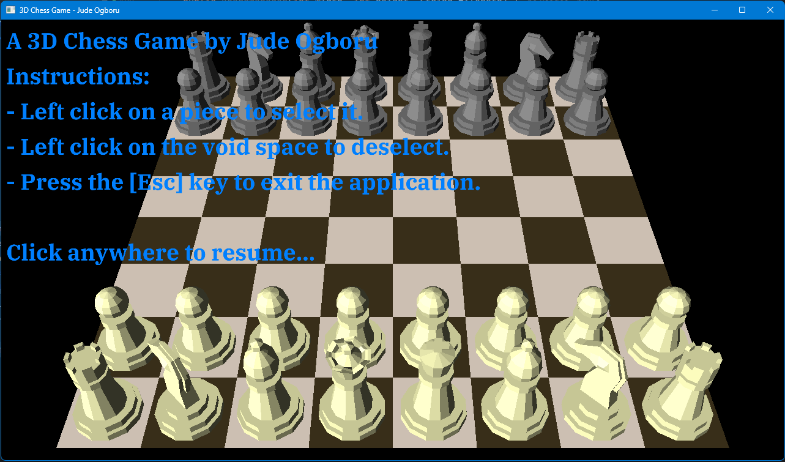

# Chess In Java

Attempting to create a 3D engine with chess as the example game

## Attributions

### Audio

- [stab-f-01-brvhrtz-224599.mp3](https://pixabay.com/sound-effects/stab-f-01-brvhrtz-224599/) - from pixabay.com

### Texture

- [wall.jpg](https://learnopengl.com) - from learnopengl.com

### Font Rendering Tutorial

- [Site](https://dev.to/shreyaspranav/how-to-render-truetype-fonts-in-opengl-using-stbtruetypeh-1p5k) & [GitHub Repository](https://github.com/shreyaspranav/stb-truetype-example)

### Fonts

- [IBMPlexSerif.ttf](https://fonts.google.com) - from fonts.google.com

### Rules for Chess

- [Chess Delta](https://chessdelta.com/chess-pieces-moves/)

> All resources not attributed are created by me and are therefore subject to the same license as this software

# How to use

You can run the TestingApplication class located [here](src/test/java/com/crossly/TestingApplication.java)

It simply renders a textured square which can be clicked on to play a sound.

It also implements a fly camera ie `W`,`A`,`S`,`D` to move & hold the `Right Mouse Button` to rotate the camera.

<b>OR</b>

Run the Chess class located [here](src/main/java/com/crossly/chess/Chess.java)

It can be played normally with basic moves & special moves.
But no detection of Check Mate has been implemented, and the game doesn't end when the king is taken.
Basic instructions are rendered on the screen once the application is started.

Pressing `Esc` brings up the overlay unless it is already open, in which case it closes the application.

### Currently Focused On

- Detecting check mates